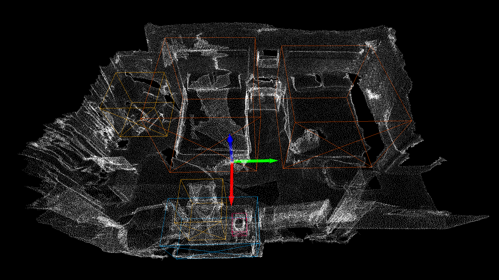
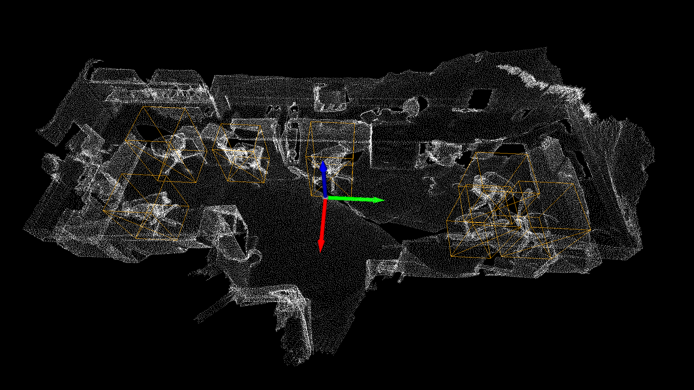
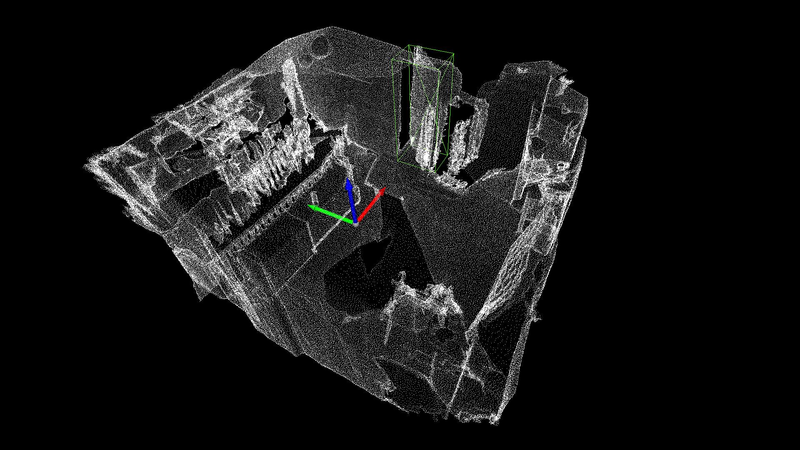
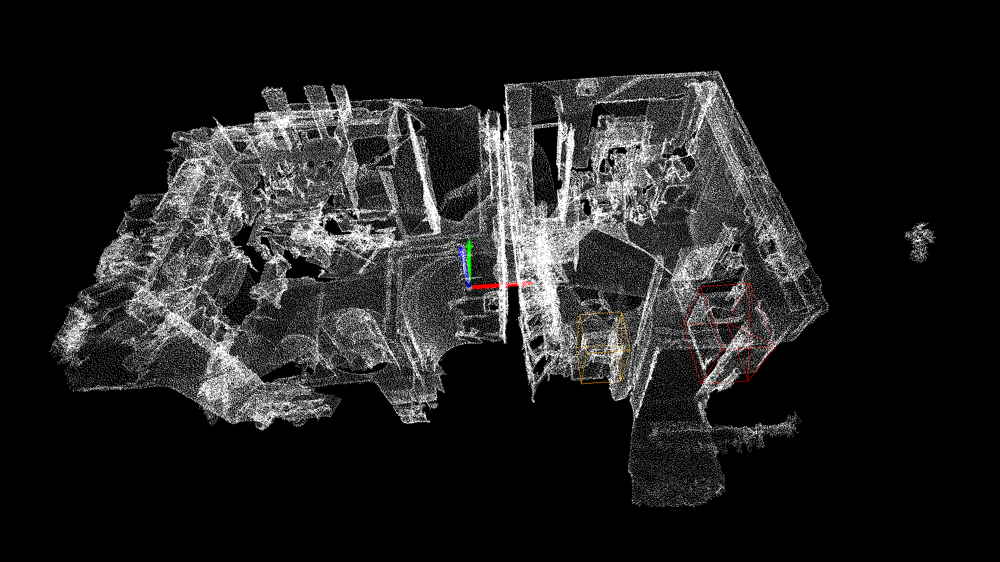
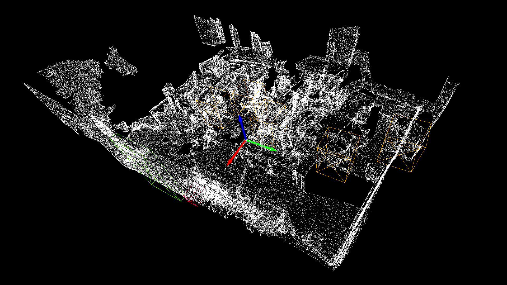
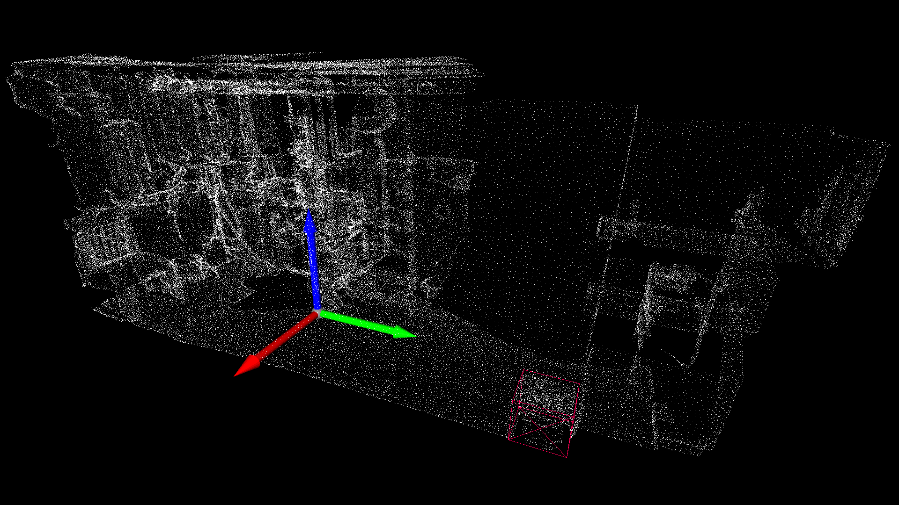
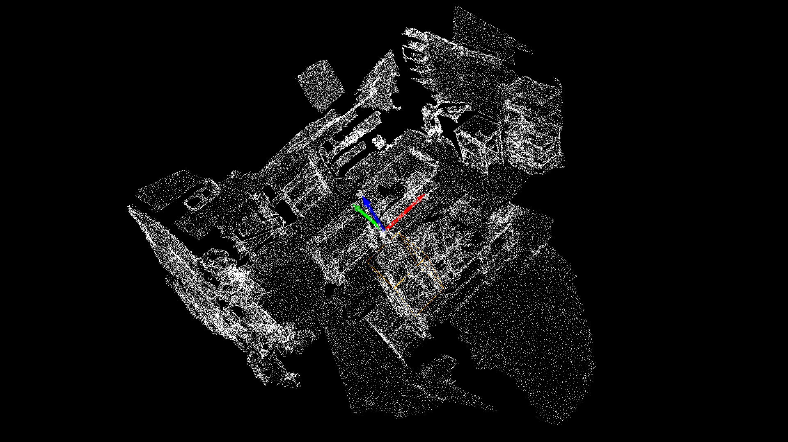
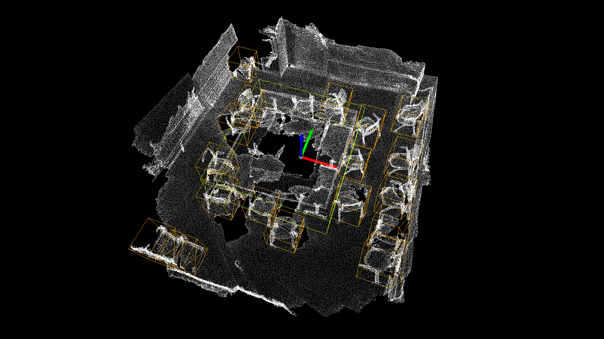
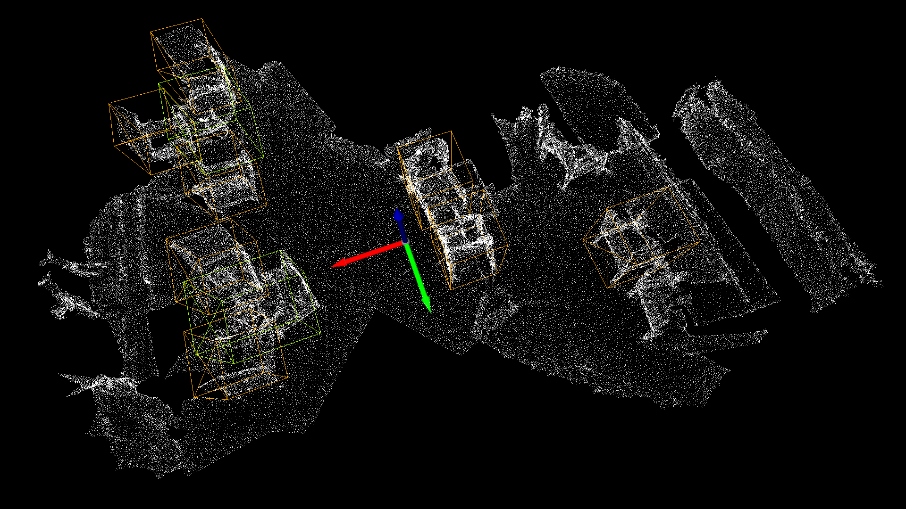
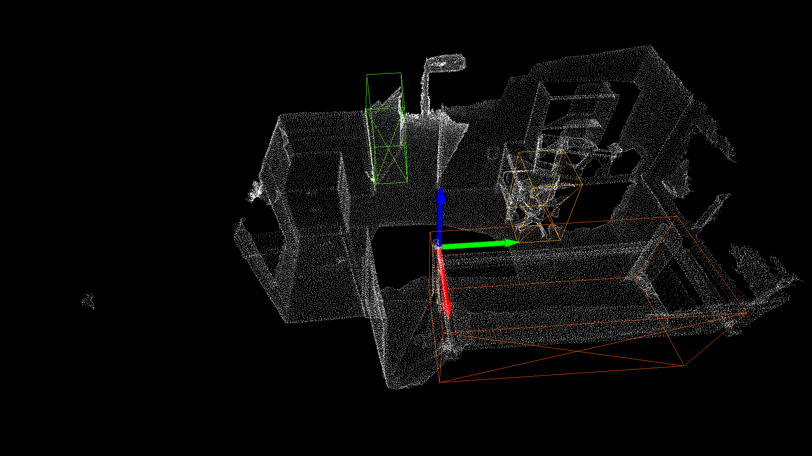

# Gallery on model prediction #

- This is the showcase from [Visualize Data](https://github.com/6DammK9/CAGroup3D/blob/win10-dev/readme_win10.md#visualize-data) in the win10 readme. **10 random scene** is picked for detection from the valication dataset

- The ground truth is not shown (coming soon). Also class labels are not available.

- The "finetuned" version of the model is used. i.e. "EP9" for `scannet`, and "EP13" for `sunrgbd`.

- It may **throw runtine error** due to the platform / adoption conflict. It will be shown accordingly.

## Model info / Class labels ##

- Note that the "color" of the class labels are equally spread in [HSL scale (rainbow color)](https://en.wikipedia.org/wiki/HSL_and_HSV).

- Model links are in [Performance / Pretrained model and logs](https://github.com/6DammK9/CAGroup3D/blob/win10-dev/readme_win10.md#performance--pretrained-model-and-logs)

- Class labels are reflected from `CLASS_NAMES` in the YAML configurations.  

|Desctiption|scannet|sunrgbd|
|---|---|---|
|Config|[yaml](https://github.com/6DammK9/CAGroup3D/blob/win10-dev/tools/cfgs/scannet_models/CAGroup3D.yaml)|[yaml](https://github.com/6DammK9/CAGroup3D/blob/win10-dev/tools/cfgs/sunrgbd_models/CAGroup3D.yaml)|
|Class names|`[ 'cabinet', 'bed', 'chair', 'sofa', 'table', 'door', 'window', 'bookshelf', 'picture', 'counter', 'desk', 'curtain', 'refrigerator', 'showercurtrain', 'toilet', 'sink', 'bathtub', 'garbagebin']`|`['bed', 'table', 'sofa', 'chair', 'toilet', 'desk', 'dresser', 'night_stand', 'bookshelf', 'bathtub']`|
|Scene counts|312|5050|

## Detections ##

- Image caption: Scene ID with max prediction score (confidence from 0 to 1)
- **Index count from 0**
- X / Y / Z axis may not aligned. View point has been hand crafted.
- Screenshot is done by pressing `PrintScreen` in Open3D window (scannet) and using Snipping tools (sunrgbd).

|Index|Scannet V2|SunRGBD|
|---|---|---|
|0| *264 (0.7333)*| *4265 (0.3109)*|
|1| *237 (0.7407)*| *3828 (0.4564)*|
|2| *132 (0.5842)*| *2124 (0.4953)*|
|3| *081 (0.5720)*| *1308 (0.5694)*|
|4| *160 (0.6681)*| *2582 (0.2525)*|
|5| *127 (0.4390)*| *2045 (0.1051)*|
|6| *245 (0.5019)*| *3959 (0.4579)*|
|7| *095 (0.7480)*|**Runtime Error** *1532*|
|8| *149 (0.6923)*| *2407 (0.2405)*|
|9| *183 (0.7048)*| *2947 (0.4634)*|
