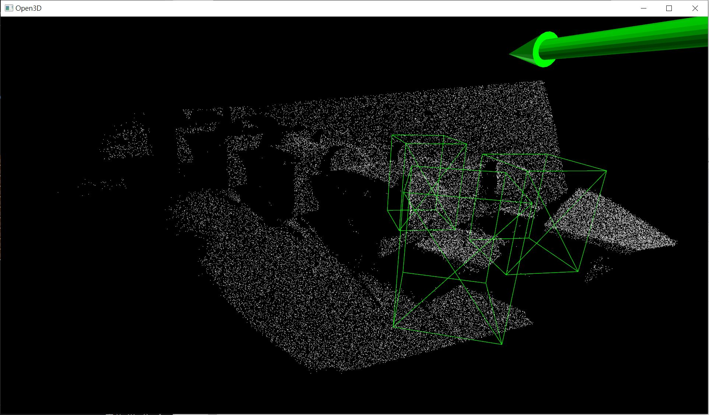
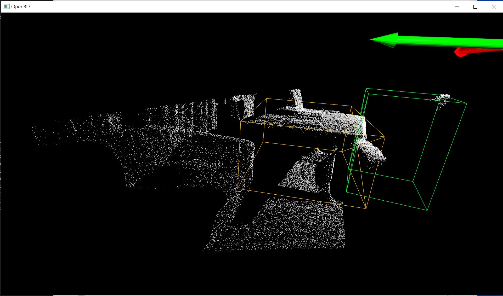

# Running CAGroup3D in Winodws 10 #

 *Detection from a "finetuned" model solely in Windows 10 PC.*

## Environments ##

- (Passed) Testing environment: X299 + i7-7820X + Win10 22H2 + RTX 2080 Ti + ~~72GB~~ 128GB DDR4 + 480GB SATA SSD
- (Passed) Another testing environment: C602 + 2x E5-2650V4 + Win10 22H1 + GTX 1080 Ti + 256GB DDR4 + 500GB SATA SSD
- **WSL2 does not work.** CUDA crash hopelessly.

## Objective ##

- Train with **joint dataset** (ScanNetV2 + Sun RGB-D) and examine the result against both tasks.
- Not focused on reproduce the data (obviously different CUDA version will produce different results)
- ~~Some live demo with Jupyter notebook~~

## Before cloning this repo ##

- (Optional) [VSCode](https://code.visualstudio.com/) has terminal which is not easily interrupted and [notepad++](https://notepad-plus-plus.org/downloads/) for non ascii display.

- Newest GPU driver. CUDA version in this repo will be 11.7. Use `nvidia-smi` to check.

- Python ~~3.8+~~ **3.10**. To switch [POSIX only library](https://pypi.org/project/SharedArray/) to [native implementation](https://docs.python.org/3/library/multiprocessing.shared_memory.html).

- Prepare at least 40GB (dataset) + 20GB (programs) of disk space! 

- Install [CUDA Toolkit 11.7](https://developer.nvidia.com/cuda-11-7-0-download-archive)

- Install anaconda. [Miniconda](https://docs.conda.io/en/latest/miniconda.html) would be more flexable.

- Install [Microsoft C++ Build Tools](https://visualstudio.microsoft.com/zh-hant/visual-cpp-build-tools/)

- [Ref CSDN](https://blog.csdn.net/m0_37890541/article/details/107723861) [Ref stackoverflow](https://stackoverflow.com/questions/70013/how-to-detect-if-im-compiling-code-with-a-particular-visual-studio-version) Modify `host_config.h`: `_MSC_VER >= 2000` 

- Prepare a python environment (python 3.10 + pytorch 1.13.1+cu117 + spconv cu117) ~~copy manually in cmd~~:

- [If there is some strange SSL error](https://github.com/conda/conda/issues/11795#issuecomment-1340010125)

```sh
# python=3.11 will crash in application!
conda create -n cagroup3d-env -c conda-forge scikit-learn python=3.10
conda activate cagroup3d-env

# Gamble on cu117 (nvidia-smi shows GTX 2080Ti + CUDA 12.1), as pytorch has cu117 also
pip install spconv-cu117

# Yea, need torch. Must be 1.13.1.
pip install torch==1.13.1+cu117 torchvision --extra-index-url https://download.pytorch.org/whl/cu117

# Version conflict between numpy and numba
conda install -c conda-forge numba

# OMP: Error #15. Alternatively you can set a OS flag
#os.environ["KMP_DUPLICATE_LIB_OK"] = "TRUE"
conda install -c conda-forge nomkl

# Tensorboard
conda install -c conda-forge tensorboard

# For evalulation
conda install -c conda-forge terminaltables

# For "plan a" of data visualisation
conda install -c conda-forge matplotlib

# For "plan b" of data visualisation
conda install -c conda-forge mayavi
```

- MinkowskiEngine is troublesome. Head to [this git issue](https://github.com/NVIDIA/MinkowskiEngine/issues/530) and download [the windows package](https://github.com/NVIDIA/MinkowskiEngine/files/10931944/MinkowskiEngine-0.5.4-py3.10-win-amd64.zip). If you're using non 3.10, you may need to manually make the package.

```sh
pip install ninja open3d
pip install MinkowskiEngine-0.5.4-cp310-cp310-win_amd64.whl
```
- **WSL2 is not working.**

- Now it is good to clone. Final check:

```sh
# Should return true
python -c "import torch; print(torch.cuda.is_available())"
# Should also return true
python -c "import MinkowskiEngine as ME; print(True)"
```

## After cloning this repo ##

- ~~Endless CPP debugging~~:

```sh
cd CAGroup3D
python setup.py develop > logs/pcdet.txt
```

- Additional CUDA ops looks fine:
```sh
# rotate iou ops
cd CAGroup3D/pcdet/ops/rotated_iou/cuda_op
python setup.py install > ../../../../logs/cuda_ops_rotated_iou.txt
# knn ops
cd ../../knn
python setup.py develop > ../../../logs/cuda_ops_knn.txt
```

## Dataset ##

- [Use prepared dataset.](https://drive.google.com/drive/folders/1sKvq4WBSEb4CWMdCTN6lCHLXnn3NwUv_). `DATA_PATH` could be in full path. Currently placed as `../data/scannet_data/ScanNetV2` and `../data/sunrgbd_data/sunrgbd`.

## Training ##

- Note that `CUDA_VISIBLE_DEVICES=ALL` (omitted) and `num_gpus=1` in this case. ~~Poor Windows PC.~~ 
- Also the `CAGroup3D.yaml`: `BATCH_SIZE_PER_GPU: 1`
- **And windows doesn't support bash in this case!** Also this time CMD / BAT files are not provided.
- Notice the actual process arguement. [Also switched to torchrun.](https://pytorch.org/docs/stable/elastic/run.html)

```sh
cd tools/
#scannet
torchrun --nproc_per_node=1 --rdzv_endpoint=localhost:7861 train.py --launcher pytorch --cfg_file cfgs/scannet_models/CAGroup3D.yaml --ckpt_save_interval 1 --extra_tag cagroup3d-win10-scannet-train --fix_random_seed > ../logs/train_scannet.txt
#sunrgbd
torchrun --nproc_per_node=1 --rdzv_endpoint=localhost:7862 train.py --launcher pytorch --cfg_file cfgs/sunrgbd_models/CAGroup3D.yaml --ckpt_save_interval 1 --extra_tag cagroup3d-win10-sunrgbd-train --fix_random_seed > ../logs/train_sunrgbd.txt
```

- Tensorboard (cmd output is messy), original code used [tensorboardX](https://github.com/lanpa/tensorboardX): 

```sh
#scannet
tensorboard --logdir output/scannet_models/CAGroup3D/cagroup3d-win10-scannet-train/tensorboard
#sunrgbd
tensorboard --logdir output/sunrgbd_models/CAGroup3D/cagroup3d-win10-sunrgbd-train/tensorboard
``` 

- Train from pretrained model (Remember to move the directory and calculate the epoch):
```sh
cd tools/
#scannet
torchrun --nproc_per_node=1 --rdzv_endpoint=localhost:7861 train.py --launcher pytorch --cfg_file cfgs/scannet_models/CAGroup3D.yaml --pretrained_model ../output/scannet_models/CAGroup3D/cagroup3d-win10-scannet-train-good/ckpt/checkpoint_epoch_8.pth --ckpt ../output/scannet_models/CAGroup3D/cagroup3d-win10-scannet-train-good/ckpt/checkpoint_epoch_8.pth --epochs 9 --ckpt_save_interval 1 --extra_tag cagroup3d-win10-scannet-train --fix_random_seed > ../logs/train_scannet.txt
#sunrgbd
torchrun --nproc_per_node=1 --rdzv_endpoint=localhost:7862 train.py --launcher pytorch --cfg_file cfgs/sunrgbd_models/CAGroup3D.yaml --pretrained_model ../output/sunrgbd_models/CAGroup3D/cagroup3d-win10-sunrgbd-train-good/ckpt/checkpoint_epoch_12.pth --ckpt ../output/sunrgbd_models/CAGroup3D/cagroup3d-win10-sunrgbd-train-good/ckpt/checkpoint_epoch_12.pth --epochs 13 --ckpt_save_interval 1 --extra_tag cagroup3d-win10-sunrgbd-train --fix_random_seed > ../logs/train_sunrgbd.txt
```

## Hours for training ##

- `ScanNetV2`: Takes around **96 hours** for a single epoch. (`BATCH_SIZE=16`)
- `SUNRGBD V1`: Takes around **36 hours** for a single epoch. (`BATCH_SIZE=16`)
- `BATCH_SIZE` Has *no effect*. Keep waiting.

## Evaluation ##

- Although the CPU usage is not very intense, do not run both evals in the same time. You may crash the OS (kernel), and get the scary [GPU error code 43](https://www.nvidia.com/en-us/geforce/forums/game-ready-drivers/13/273008/code-43-please-help/). Disable then re-enable the GPU driver will bring it back.

```sh
cd tools/
#scannet
torchrun --nproc_per_node=1 --rdzv_endpoint=localhost:7863 test.py --launcher pytorch --cfg_file cfgs/scannet_models/CAGroup3D.yaml --ckpt ../output/scannet_models/CAGroup3D/cagroup3d-win10-scannet-train/ckpt/checkpoint_epoch_1.pth --extra_tag cagroup3d-win10-scannet-eval --save_to_file > ../logs/eval_scannet.txt
#sunrgbd
torchrun --nproc_per_node=1 --rdzv_endpoint=localhost:7864 test.py --launcher pytorch --cfg_file cfgs/sunrgbd_models/CAGroup3D.yaml --ckpt ../output/sunrgbd_models/CAGroup3D/cagroup3d-win10-sunrgbd-train/ckpt/checkpoint_epoch_1.pth --extra_tag cagroup3d-win10-sunrgbd-eval --save_to_file > ../logs/eval_sunrgbd.txt
```

## Hours for evaluation ##

- `ScanNetV2`: Takes around **2 hours**.
- `SUNRGBD V1`: Takes around **5 hours**.
- `args_workers`: No obvious effect. Keep waiting.

## Performance / Pretrained model and logs ##

- Including our "epoch1" result, pretrained model from original author to validate our modified code, and potentially our "finetuned model" (`e8+1`, `e12+1`).

|Task|`scannet-e1`|`sunrgbd-e1`|`scannet-e8`|`sunrgbd-e12`|
|---|---|---|---|---|
|Huggingface|[cagroup3d-win10-scannet](https://huggingface.co/6DammK9/cagroup3d-win10-scannet)|[cagroup3d-win10-sunrgbd](https://huggingface.co/6DammK9/cagroup3d-win10-sunrgbd)|[Main repo](https://github.com/Haiyang-W/CAGroup3D#main-results)|[Main repo](https://github.com/Haiyang-W/CAGroup3D#main-results)|
|`mAP_0.25`|2.6154|4.3875|74.0403|65.9022|
|`mAP_0.50`|0.1057|0.7867|61.2493|47.9277|
|`mAR_0.25`|8.0527|7.8397|89.6589|93.2833|
|`mAR_0.50`|0.7545|2.0583|76.1650|67.8665|

## Visualize data ##

- No explaination from original repo, ~~expected aligned with the provided `demo.py`~~ rewritten from `test.py`.
- Draw *10 random scenes* from dataset (`scannet` = 312, `sunrgbd` = 5050).
- Detection box is drawn if it prediction score exceed `draw_scores` or it is the best prediction.
- Color scale: **HSL** across class labels. Sequence aligned with `CLASS_NAMES`.
- Expected using **Open3D** (plan a) for visualisation. Mayavi has issue on view perspectives, although it has 3d labels as prediction scores.

```sh
cd tools/
#scannet
python demo.py --cfg_file ../tools/cfgs/scannet_models/CAGroup3D.yaml --ckpt ../output/scannet_models/CAGroup3D/cagroup3d-win10-scannet-train-good/ckpt/checkpoint_epoch_8.pth --draw_scores 0.5 --draw_idx 10
#sunrgbd
python demo.py --cfg_file ../tools/cfgs/sunrgbd_models/CAGroup3D.yaml --ckpt ../output/sunrgbd_models/CAGroup3D/cagroup3d-win10-sunrgbd-train-good/ckpt/checkpoint_epoch_12.pth --draw_scores 0.4 --draw_idx 10
```

## Control keys on Open3D ##

- `Left Click`: Rotate from focal point
- `Crtl` + Left Click: Pan
- `Shift` : Rotate per axis
- `PrintScreen`: Print screen (Open3D Windows) in PNG + Save meta file (JSON)
- `Q`: Quit

## Gallery ##

- See the [gallery](./docs/cagroup3d/gallery/readme.md) for details.

 *Example from SunRGBD*

## Rants ##

- [error C2131 on EPS](https://github.com/open-mmlab/OpenPCDet/pull/1040)
- [error C2131: expression did not evaluate to a constant](https://github.com/open-mmlab/OpenPCDet/issues/681#issuecomment-980000235)
- [Still C2131:](https://blog.csdn.net/qq_39027296/article/details/104936998)
- ['uint32_t' does not name a type](https://stackoverflow.com/questions/11069108/uint32-t-does-not-name-a-type): `#include <cstdint>`, and check `inline int check_rect_cross` in `iou3d_nms_kernel.cu`
- [THC/THC.h: No such file or directory](https://discuss.pytorch.org/t/question-about-thc-thc-h/147145/8). [Use ATen instead](https://github.com/sshaoshuai/Pointnet2.PyTorch/issues/34)
- ["sys/mman.h": No such file or directory](https://github.com/open-mmlab/OpenPCDet/issues/1043) [Install gygwin](https://www.cs.odu.edu/~zeil/FAQs/Public/vscodeWithCygwin/) with additional packages: `gcc-core gcc-debuginfo gcc-objc gcc-g++ gdb make`: **Not effective, but can workaround by using WSL2**. Rewrite the code to remove `SharedArray` instead.
- [The training backend is switched to GLOO](https://github.com/ray-project/ray_lightning/issues/13).
- `os.environ["KMP_DUPLICATE_LIB_OK"] = "TRUE"` is needed. ME can't be installed in WSL2.
- `convolution_cpu.cpp:61, assertion (!kernel.is_cuda()) failed. kernel must be CPU`: `ME.SparseTensor(device="cpu")` globally
```
from MinkowskiEngineBackend._C import is_cuda_available
me_device = None if is_cuda_available() else "cpu"
x = ME.SparseTensor(coordinates=c, features=f, device=me_device)
```
- ~~**Just force everything into CPU.**~~. `BATCH_SIZE_PER_GPU` must not be 1.
- [CHECK_CUDA failed.](https://zhuanlan.zhihu.com/p/541302472) ~~**Checks skipped.**~~ Meanwhile switched to `__device__ inline int check_rect_cross`. ~~Now get memory issue.~~ Make sure **ME runs in CPU and pcdet runs in CUDA**.
- [CUDA error: device-side assert triggered.](https://stackoverflow.com/questions/51691563/cuda-runtime-error-59-device-side-assert-triggered) [hint1](https://discuss.pytorch.org/t/runtimeerror-cuda-error-device-side-assert-triggered-index-out-of-bounds-failed/87827) [hint2](https://github.com/IrvingMeng/MagFace/issues/15) [hint3](https://stackoverflow.com/questions/51691563/cuda-runtime-error-59-device-side-assert-triggered) [hint4](https://blog.csdn.net/li_jiaoyang/article/details/116047462) [hint5](https://discuss.pytorch.org/t/runtimeerror-cuda-error-device-side-assert-triggered/34213/8) **eval() on CPU.**
- Indexing error revealed. [e.g.](https://blog.csdn.net/qq_41375609/article/details/106227961). *Real debug*. `knn` force cuda: Done.
- [long should be int_64t](https://www.jianshu.com/p/755952cfce64). [long in Flutter](https://api.flutter.dev/flutter/dart-ffi/Long-class.html). [stackoverflow](https://stackoverflow.com/questions/1918436/difference-between-long-and-int-in-c)
- sunrgbd's code coverage is larger then scannet, meanwhile the dataset is 2x smaller. Test with this dataset first. ~~It takes 30-60 mins to crash but scannet takes 2Hrs.~~
- `find_unused_parameters=True` is mandatory now. Not sure if we can train with multiple GPUs later on.
- Train from checkpoint. ~~Maybe have some spare time to train a few more EPs.~~ 1EP should be fesible since we don't need to change code.
- Why the model cannot be eval? Somehow some raw data is in `ndarray` instead of `tensor`. However the upside is it is already in CPU.
- Visualization / play with estimation. There is a `result.pkl` ~~without any explaination~~ via `pickle.dump`, *which is insufficient to visualize*. *Oh no* `demo.py` is another rabbit hole. Remade with `test.py` and it still crashes. ~~There is so many limitation from Open3D.~~
- **TODO** Adding GPU support from teammate's great work: [His fork form this repo.](https://github.com/test11111223/CAGroup3D) [His tryhard mod of Minkowski Engine according to this repo.](https://github.com/test11111223/MinkowskiEngine). Note that **it is still in active development.**
- **TODO** Maybe export the detections to TensorBoard also. [Open3D for TensorBoard.](http://www.open3d.org/docs/latest/tutorial/visualization/tensorboard_plugin.html)